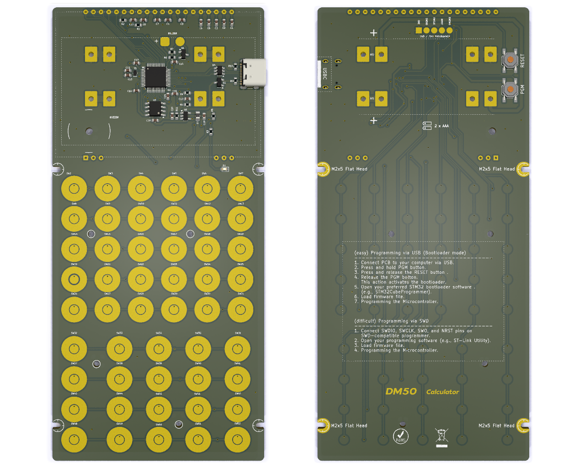

# DM50 calculator

The main features of the calculator are the following:

 - 32bit ARM Cortex-M33 MCU ultra low power.
 - Mathematical coprocessor acceleration.
 - Floating Point Unit (FPU).
 - 274KB SRAM.
 - 512KB FLASH MCU memory.
 - 16MB FLASH storage Octo-SPI (accessible via USB).
 - USBC port, connects as USB mass storage device.
 - Graphic LCD Display (128x64 dots).
 - Same keys as the legendary HP48.
 - ESD protection of USBC.
 - LiPO 3.7V rechargeable battery, with JST PH2.0 connector.
 - Possibility of using AAA batteries.
 - Battery charge level sensor.
 - USB power and battery charging status LED indicators.
 - JTAG debug port.
 - Sound via 4 KHz buzzer.
 - Temperature sensor.

# Hardware
Below is the list of electronic components used to manufacture the board.
| Component | Ref | Description |
| - | - | - |
| SoC Processor | STM32U535CB | ARM Cortex-M33 ultra low power with FPU |
| Display | EA_DOGL128L-6 | STN reflective display 128x64 |
| Flash 16MB | W25Q128JVSIQ | 16MB Flash |
| Voltage Regulator | ADP2108 | Vin 2.3 - 5.5, Vout 3.3 |
| Transistor | MMBT3904L | 200 mA, 40 V NPN Bipolar Junction Transistor |
| USB protection | USBLC6-2 | ESD protection of VBUS |

## MCU
### STM32U535CB
This is the brain of our calculator. Ultra-low-power Arm Cortex-M33 MCU+FPU, 240 DMIPS, core clocked at 160 MHz and 274 KB of Static RAM.

[STM32U535CBT6 datasheet](docs/pdf/stm32u535cb.pdf)
[Arm Cortex-M33 Developers Guide](https://developer.arm.com/documentation/100235/0004/the-cortex-m33-processor/)

## Flash memory
### W25Q128JVSIQ
This is the persistant memory of our calculator. This chip stores 16 MB (megabytes) of data, and serves it over a 133 MHz Quad-SPI bus.

[AT25SF641 datasheet](docs/pdf/AT25SF641.pdf)

## Logic power supply
### ADP2108AUJ-3.3
The ADP2108 is a high efficiency, low quiescent current stepdown dc-to-dc converter.
This part regulates the voltage from the USBC input.

[ADP2108AUJ-3.3 datasheet](docs/pdf/ADP2108AUJ-3.3.pdf)

## ESD USB protection
### USBLC6-2SC6
The USB port can receive electrostatic discharges. Those very high voltage surge can permanently damage electronic components. This part evacuates the surge entering from the USB port and protects the whole circuit.

[USBLC6-2SC6 datasheet](docs/pdf/USBLC6-2SC6.pdf)

## Display
### EA_DOGL128L-6
The EA DOGL128L-6 is a 128x64-pixel graphics display. 
The L model is reflective and does not have LED backlighting.

[EA_DOGL128X-6 datasheet](docs/pdf/EA_DOGL128X-6.pdf)

## Batteries
Supports the following batteries:

| Batteries | Capacity (mha) |
| --- | :---: |
| AAA Alkaline | 900 - 1155 |
| AAA Ni-MH | 800 - 1000 |
| LiPO 402025 (4.0x20x25) | 150 |
| LiPO LP272247 (2.7x22x47) | 260 |

# EDA Software
For the development of the hardware, the KiCad tool has been used.

[KiCad URL](https://www.kicad.org/)

# PCB Making
The board can be ordered from PCBWay, JLCPCB, etc.
In addition, 3D designs for the calculator case and keyboard are included.

PCB front:

PCB back:

# SoCs Comparative
General comparison, taking the maximum specifications between all the SOCs of each family.

| Serie | PW OFF | RAM | Flash |
| --- | :---: | :---: | :---: |
| STM32L4 | 8 nA | 320KB | 64KB - 1MB |
| STM32L4+ | 8 nA | 320KB | 512KB - 2MB |
| STM32L5 | 17 nA | 256KB | 256KB - 512KB |
| STM32U5 | 90 nA | 768KB | 1MB - 2MB |

## Mathematical coprocessor
The CORDIC co-processor provides hardware acceleration of certain mathematical functions, notably trigonometric, commonly used in motor control, metering, signal processing and many other applications. It speeds up the calculation of these functions compared to a software implementation, allowing a lower operating frequency, or freeing up processor cycles in order to perform other tasks.

The CORDIC main features are:

* 24-bit CORDIC rotation engine
* Circular and hyperbolic modes
* Rotation and vectoring modes
* Functions: sine, cosine, sinh, cosh, atan, atan2, atanh, modulus, square root, natural logarithm
* Programmable precision
* Low-latency AHB slave interface
* Results can be read as soon as ready without polling or interrupt
* DMA read and write channels
* Multiple register read/write by DMA

Limit: maximum precision of the coprocessor is 20 bits in the best case.

Comparative performance CORDIC versus software (math.h functions), in CPU cycles:

| Method | sin,cos | atan | exp | ln | sqrt |
| :- | -: | -: | -: | -: | -: |
| CORDIC | 29 | 33 | 39 | 27 | 23 |
| Software | 416 | 332 | 319 | 260 | 58 |

# Schematic

# PCB

# Case parts
Freecad software has been used to design the casing.
The spaces have been optimized to reduce the size, continuously giving shape to the calculator and improving the user experience.

## Molds (case & keys)
The design of the box has been optimized for a professional finish, developing the molds for serial plastic extrusion.
The 3D model finishes undergo a post-processing process to create the mold master, including the smooth textured finish.!

## Keyboard Serigraphy
Printing numbers on the keyboard is done using a sublimation transfer process, ordering the sheets from local companies and ironing them onto the keyboard.

## Faceplate
A master faceplate has been designed although it can be exchanged by the user through a simple manual process.

The front plate is printed on photographic paper and cut to size, with professional results. A photo-quality printer is recommended, such as the Epson Ecotank.

To create the faceplate, the Inkscape tool has been used to edit the SVG and the font used is Latin Modern Math, licensed by the GUST Font License, developed by the TeX user group in Poland, and can be used for academic use. , commercial or academic.

[Latin Modern Math font](https://www.gust.org.pl/projects/e-foundry/latin-modern "Latin Modern Math font")

# Reference
## Hardware
Comparison of the hardware used in the different reference calculators:
 
| Year | Model | Processor | RAM | FLASH | Display |
| :-: | - | - | -: | -: | - |
| 1988 | [HP42S](https://en.wikipedia.org/wiki/HP-42S) | Saturn | 8KB | 64KB | 131×16 |
| 1993 | [HP48G](https://en.wikipedia.org/wiki/HP_48_series) | Saturn | 32KB | 512KB | 131×64 |
| 2006 | [HP50G](https://en.wikipedia.org/wiki/HP_49/50_series) | ARM920T | 512KB | 2MB | 131×80 |
| 2013 | [TI-Nspire CX II](https://en.wikipedia.org/wiki/TI-Nspire_series#TI-Nspire_CX_II_and_TI-Nspire_CX_II_CAS) | ARM9-26EJ-S | 64MB | 128MB | 320x240 | 
| 2016 | [NumWorks](https://www.numworks.com/resources/engineering/hardware/) | STM32F730V8T6 | 256KB | 6MB | 320x240 |
| 2017 | [DM42](https://www.swissmicros.com/product/dm42) | STM32L476RG | 128KB | 6MB | 400×240 | 
| 2019 | [HP Prime G2](https://en.wikipedia.org/wiki/HP_Prime) | i. MX 6ULL | 256MB | 512MB | 320×240 |
| 2021 | [OpenRPNCalc](https://github.com/apoluekt/OpenRPNCalc) | STM32L476 | 128KB | 1MB | 400x240 |
| 2024 | [DM50](https://github.com/xavierbasc/dm50-calculator) | STM32U535CB | 274KB | 16MB | 128×64 |

## Software (GPL):
| Software | Detail |
| - | - |
| [DB48X](https://47calc.com/) | DB48X is a modern implementation of RPL |
| [C47](https://47calc.com/) | C47 is a RPN Scientific Calculator (old WP43C project) |
| [WP43](https://gitlab.com/rpncalculators/wp43) | Firmware for the WP43 pocket calculator (old WP43S project) |
| [Free42](https://github.com/thomasokken/free42) | Free42 is a software clone of the Hewlett-Packard 42S calculator |
| [TCalc](https://github.com/tylertian123/TCalc) | Firmware for STM32 CAS calculator |
| [TinyExpr](https://github.com/codeplea/tinyexpr) | parser and evaluation for math expressions |
