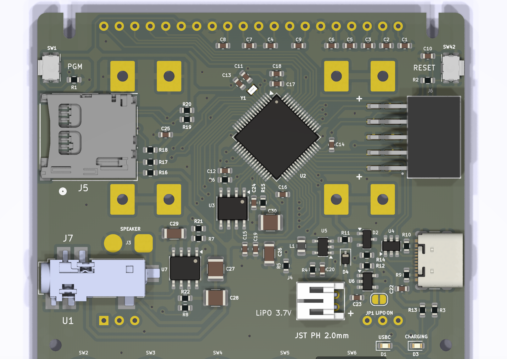
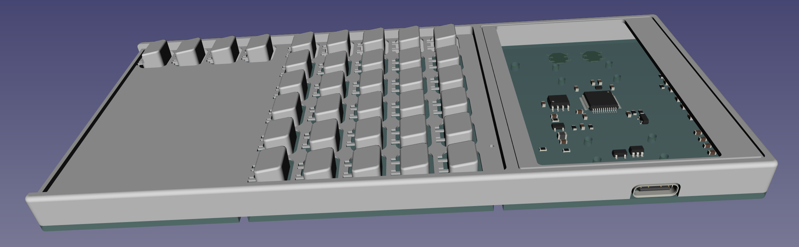

# DM50 calculator

The main features of the calculator are the following:

 - 32bit ARM Cortex-M33 MCU ultra low power.
 - Mathematical coprocessor acceleration.
 - Floating Point Unit (FPU).
 - 786KB SRAM.
 - 2MB FLASH MCU memory.
 - 16MB FLASH storage Octo-SPI (accessible via USB).
 - USBC port, connects as USB mass storage device.
 - Graphic LCD Display (128x64 dots).
 - ESD protection of USBC.
 - LiPO 3.7V rechargeable battery, with JST PH2.0 connector.
 - Possibility of using AAA batteries.
 - Battery charge level sensor.
 - USB power and battery charging status LED indicators.
 - JTAG debug port.
 - Sound via 4 KHz buzzer.
 - Temperature sensor.
 - Same number of keys as the legendary HP48.

# Hardware
Below is a list of the most relevant electronic components:

1. Processor: STM32U5 ARM Cortex-M33 ultra low power with FPU.
2. Display: EA_DOGL128L-6 STN reflective display 128x64.
3. Flash memory: W25Q128JVSIQ 16MB Flash.
4. Voltage regulator: ADP2108 Vin 2.3 - 5.5, Vout 3.3.
5. USB protection: USBLC6-2 ESD protection of VBUS.
6. Battery charger: MCP73831 Lithium-Ion/Lithium-Polymer Battery Charger.

Some of the supported batteries are as follows:

| Batteries | Capacity (mha) |
| --- | :---: |
| AAA Alkaline | 900 - 1155 |
| AAA Ni-MH | 800 - 1000 |
| LiPO 402025 (4.0x20x25) | 150 |
| LiPO LP272247 (2.7x22x47) | 260 |

***Electronic design***:

## Case
Freecad software has been used to design the casing.
The spaces have been optimized to reduce the size, continuously giving shape to the calculator and improving the user experience.

## Faceplate
A master faceplate has been designed although it can be exchanged by the user through a simple manual process.

The front plate is printed on photographic paper and cut to size, with professional results. A photo-quality printer is recommended, such as the Epson Ecotank.

To create the faceplate, the Inkscape tool has been used to edit the SVG and the font used is Latin Modern Math, licensed by the GUST Font License, developed by the TeX user group in Poland, and can be used for academic use. , commercial or academic.

[Latin Modern Math font](https://www.gust.org.pl/projects/e-foundry/latin-modern "Latin Modern Math font")

# Software
TBD

# Reference
Comparison of the ***hardware*** used in the different reference calculators:
 
| Year | Model | Processor | FREQ | RAM | FLASH | Display | MIPS |
| :-: | - | - | -: | -: | -: | :-: | -: |
| 1988 | [HP42S](https://en.wikipedia.org/wiki/HP-42S) | HP Saturn (1LF5) | - | 8KB | 64KB | 131×16 | 0.5 |
| 1993 | [HP48G](https://en.wikipedia.org/wiki/HP_48_series) | HP Saturn (1LF2) | 4MHz | 32KB | 512KB | 131×64 | 0.5 |
| 2006 | [HP50G](https://en.wikipedia.org/wiki/HP_49/50_series) | ARM9 S3C2410 | 75MHz | 512KB | 2MB | 131×80 | 75 |
| 2013 | [TI-Nspire CX II](https://en.wikipedia.org/wiki/TI-Nspire_series#TI-Nspire_CX_II_and_TI-Nspire_CX_II_CAS) | TI OMAP 3530 | 396MHz | 64MB | 128MB | 320x240 | 792 |
| 2016 | [NumWorks](https://www.numworks.com/resources/engineering/hardware/) | STM32F730V8T6 | 216MHz | 256KB | 6MB | 320x240 | 432 |
| 2017 | [DM42](https://www.swissmicros.com/product/dm42) | STM32L476RG | 80MHz | 128KB | 6MB | 400×240 |  100 |
| 2019 | [HP Prime G2](https://en.wikipedia.org/wiki/HP_Prime) | i. MX 6ULL | 528MHz | 256MB | 512MB | 320×240 | 1710 |
| 2021 | [OpenRPNCalc](https://github.com/apoluekt/OpenRPNCalc) | STM32L476 | 8MHz | 128KB | 1MB | 400x240 | 100 |
| 2023 | [DM32](https://www.swissmicros.com/product/dm42) | STM32U575 | 160MHz | 786KB | 1MB | 400×240 |  240 |
| 2024 | [`DM50`](https://github.com/xavierbasc/dm50-calculator) | STM32U575 | 160MHz | 786KB | 2MB * | 128×64 | 240 |

(*) DM50 has 2MB Flash for code execution and 16MB extra Flash (USB mass storage access)

List of ***software*** used as firmware in some calculators:

1. [DB48X](https://47calc.com/): DB48X is a modern implementation of RPL.
2. [C47](https://47calc.com/): C47 is a RPN Scientific Calculator (old WP43C project).
3. [WP43](https://gitlab.com/rpncalculators/wp43): Firmware for the WP43 pocket calculator (old WP43S project).
4. [Free42](https://github.com/thomasokken/free42): Free42 is a software clone of the Hewlett-Packard 42S calculator.
5. [TCalc](https://github.com/tylertian123/TCalc): Firmware for STM32 CAS calculator.
6. [TinyExpr](https://github.com/codeplea/tinyexpr): parser and evaluation for math expressions.
