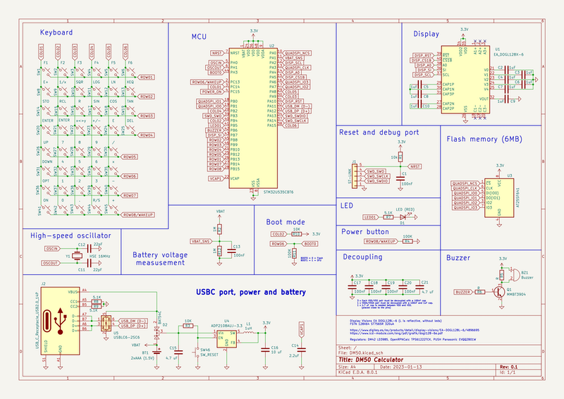

# DM50 calculator

The main features of the calculator are the following:

 - Electronic schematics and designs of the boards are open source.
 - Ultra low power ARM Cortex-M33 MCU+FPU.
 - 128-bit floating point precision implementation (IEEE 754-2008).
 - USBC port, connects as USB mass storage device.
 - 6MB flash storage, accesible por USB.
 - Graphic LCD Display.

# Hardware
Below is the list of electronic components used to manufacture the board.
| Component | Ref | Description |
| - | - | - |
| SoC Processor | STM32U535CBT6 | ARM Cortex-M33 ultra low power with FPU |
| Display | EA_DOGL128X-6 | STN reflective display 128x64 |
| Flash 4MB | W25Q32JVSS | 4MB Flash |
| Voltage Regulator | ADP2108AUJ-3.3 | Vin 2.3 - 5.5, Vout 3.3 |
| Power by USB (5V) | LD3985 | Micropower Low-Dropout Voltage Regulator |
| Transistor | MMBT3904L | 200 mA, 40 V NPN Bipolar Junction Transistor |

## MCU
### STM32U535CBT6
This is the brain of our calculator. Ultra-low-power Arm Cortex-M33 MCU+FPU, 240 DMIPS, core clocked at 160 MHz and 274 KB of Static RAM.

## Flash memory
### AT25SF641

This is the persistant memory of our calculator. This chip stores 64 Mbit of data, and serves it over a 104 MHz Quad-SPI bus.

## Logic power supply
### ADP2108AUJ-3.3

The ADP2108 is a high efficiency, low quiescent current stepdown dc-to-dc converter.
This part regulates the voltage from the USBC input.

## ESD USB protection

### USBLC6-2SC6

The USB port can receive electrostatic discharges. Those very high voltage surge can permanently damage electronic components. This part evacuates the surge entering from the USB port and protects the whole circuit.

## EDA Software
For the development of the hardware, the KiCad tool has been used.

## PCB Making

The board can be ordered from PCBWay, JLCPCB, etc.
In addition, 3D designs for the calculator case and keyboard are included.

# SoCs Comparative
General comparison, taking the maximum specifications between all the SOCs of each family.

| Serie | OFF * | ON | RAM | Flash |
| - | :-: | :-: | :-: | :-: |
| STM32L4 | 8 nA | 28 μA/MHz | 320KB | 64KB - 1MB |
| STM32L4+ | 8 nA | 28 μA/MHz | 320KB | 512KB - 2MB |
| STM32L5 | 17 nA | 62 µA/MHz | 256KB | 256KB - 512KB |
| STM32U5 | 110 nA | 19 µA/MHz | 768KB | 1MB - 2MB |

(*) Power Off with backup registers without real-time clock.

# Reference
## Hardware
Comparison of the hardware used in the different reference calculators:
 
| Model | Year | Processor | Speed | Precision | RAM | Flash | Display | Battery | Standby
| - | :-: | - | -: | :-: | -: | -: | - | - | -: |
| [OpenRPNCalc](https://github.com/apoluekt/OpenRPNCalc) | 2021 | STM32L476 | 8MHz | 10 | 128KB | 1MB | 400x240 | CR2032 | years |
| [NumWorks](https://www.numworks.com/resources/engineering/hardware/) | 2016 | STM32F730V8T6 | 216MHz | ? | 256KB | 6MB | 320x240 | CR2032 | years |
| [DM42](https://www.swissmicros.com/product/dm42) | 2017 | STM32L476RG | 80MHz | 34 | 128KB | 6MB | 400×240 | CR2032 | 3 years |
| [TI-Nspire CX II CAS](https://en.wikipedia.org/wiki/TI-Nspire_series#TI-Nspire_CX_II_and_TI-Nspire_CX_II_CAS) | 2013 | ARM9-26EJ-S | 396MHz | 14 | 64MB | 128MB | 320x240 | 3.7L1230SP | ? |
| [HP Prime G2](https://en.wikipedia.org/wiki/HP_Prime) | 2019 | i. MX 6ULL | 528MHz | 12 | 256MB | 512MB | 320×240 | EB-L1G6LLU | 46 days
 
## Software (GPL):
| Software | Detail |
| - | - |
| [WP43](https://gitlab.com/rpncalculators/wp43) | Firmware for the WP43 pocket calculator (old WP43S project) |
| [C43](https://www.classic43.com) | C43 is a RPN Scientific Calculator (old WP43C project) |
| [Free42](https://github.com/thomasokken/free42) | Free42 is a software clone of the Hewlett-Packard 42S calculator |

# To Do
Main pending tasks:
1. ~~Reference hardware and software~~.
2. Hardware design. SCH & PCB. Use components supported by PCBWay and JLCPCB.
3. Memory map publication.
4. Bootloader with ability to load new firmware from FAT-USB drive.
5. 3D designs (if required).
9. New features.